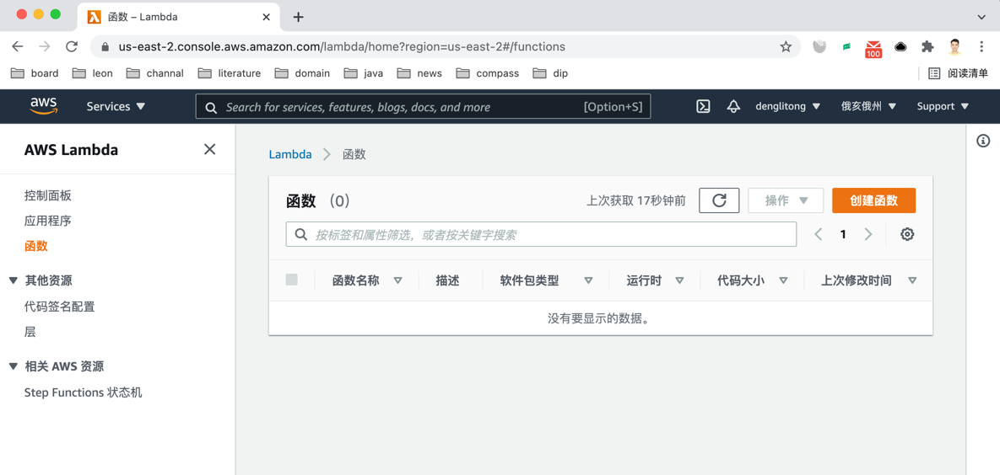
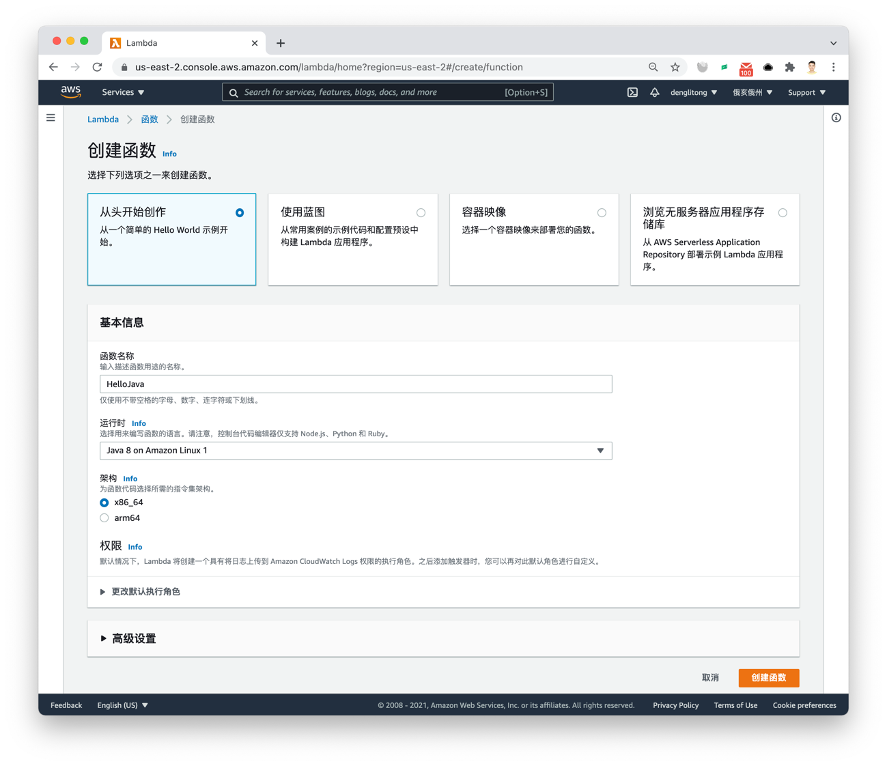
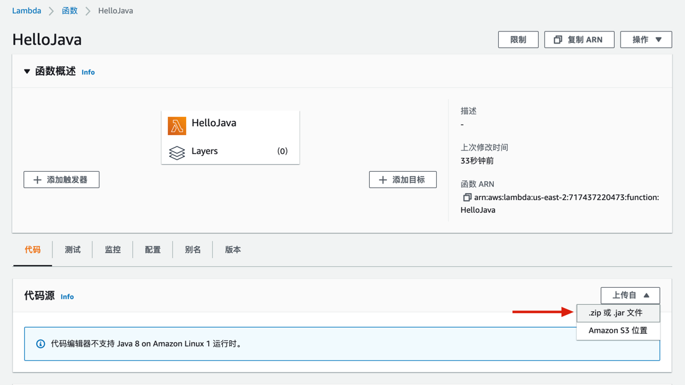
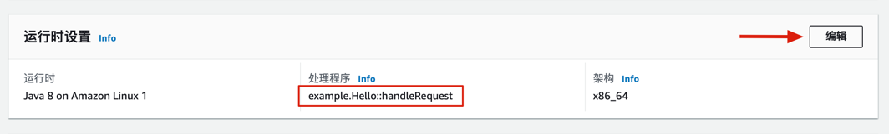
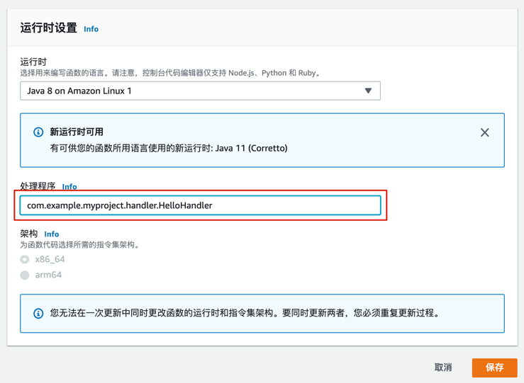
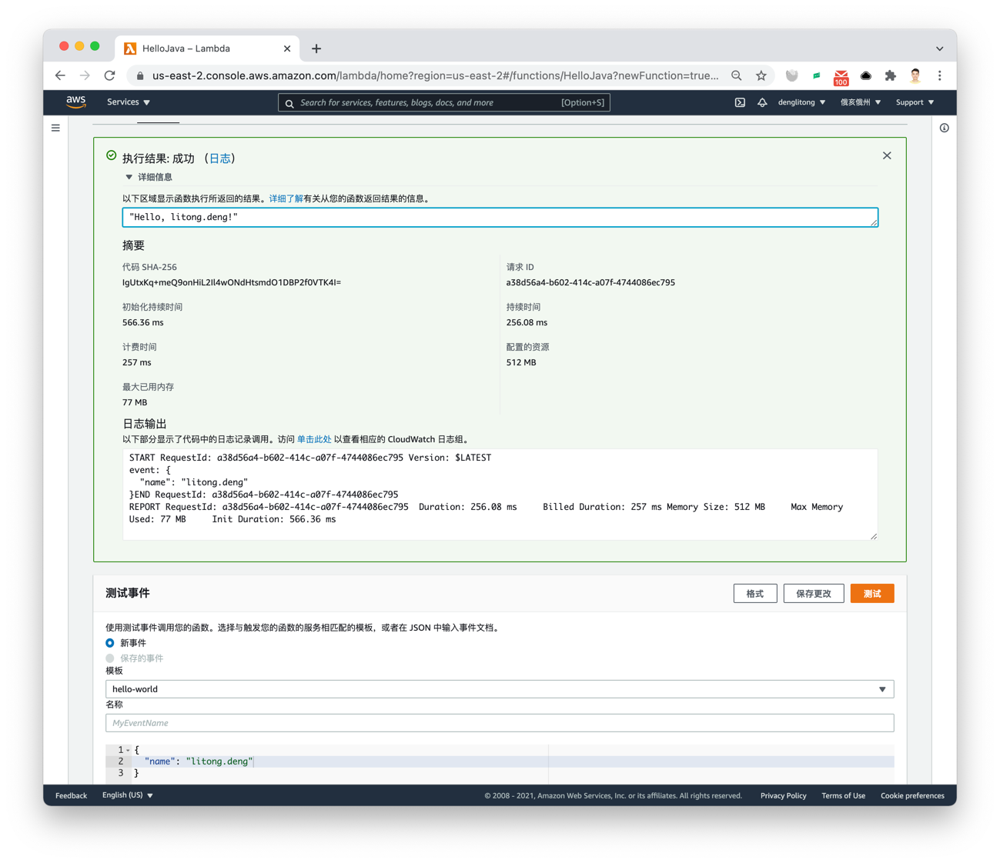

# aws labmda java demo

## 一、构建Jar包

    mvn clean package

## 二、创建lambda函数

1. 进入 [AWS Lambda控制台](https://us-east-2.console.aws.amazon.com/lambda/home?region=us-east-2#/functions)

   

2. `创建函数`

- 填写函数名称,`HelloJava`
- 选择运行时，`Java8 on Amazon Linux1`
- 完成创建

  

3. 在 `代码源` 上传Jar包

   

4. 编辑运行时设置，修改 `处理程序` ，填入lambda函数完整的包名路径

   
   
  
5. 测试lambda函数

    

## 三、触发lambda函数
    